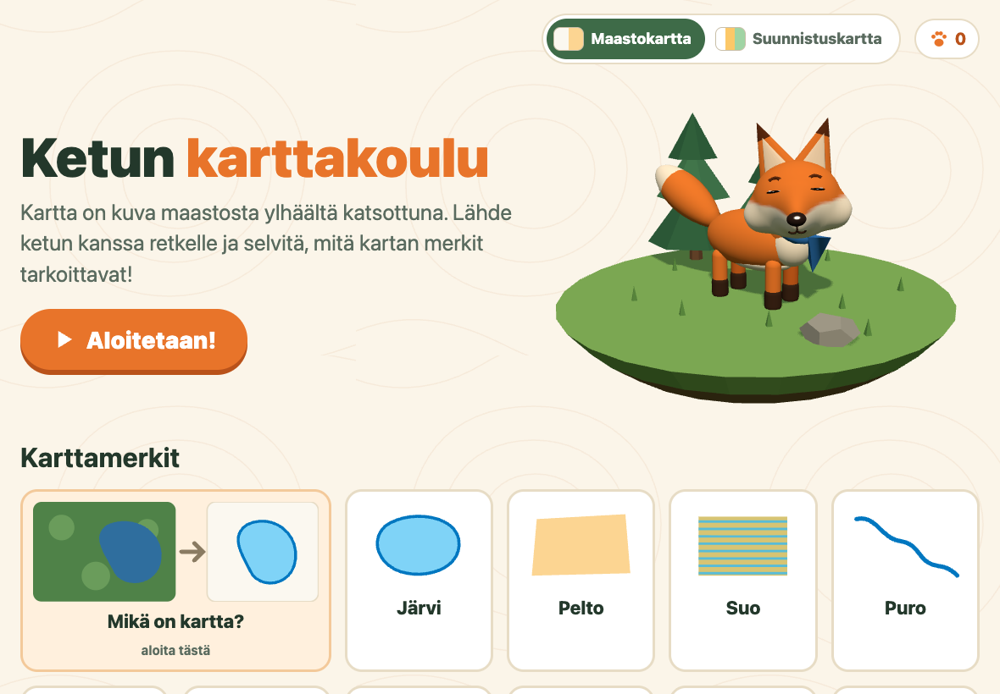
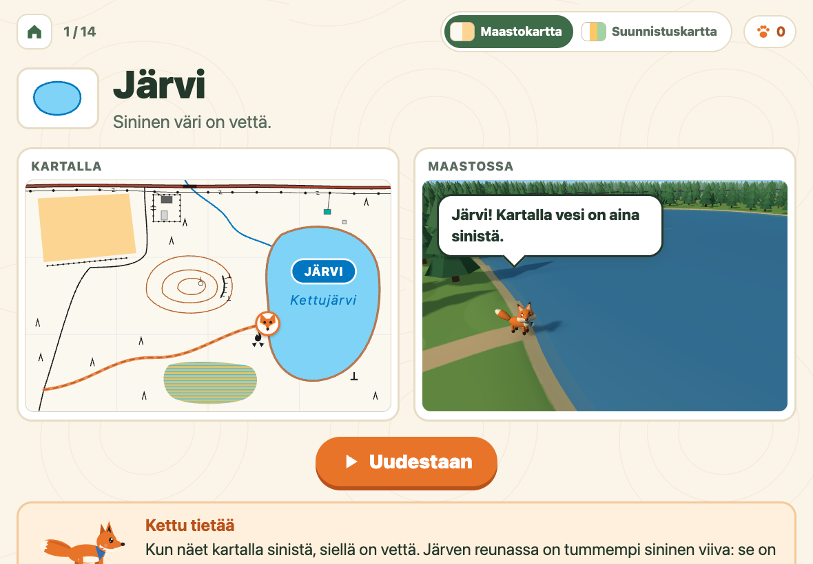
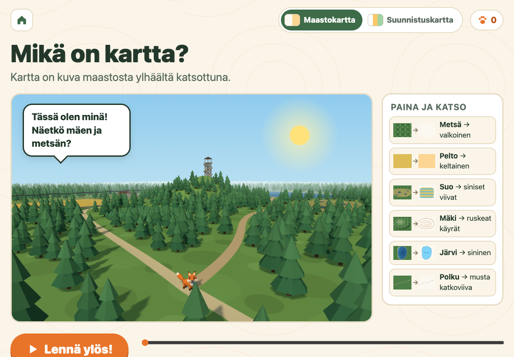

# Ketun karttakoulu (Fox's Map School)

A web app that teaches map symbols to Cub Scouts aged 7–10. A group leader shows it on a tablet and reads the texts aloud, while a 3D fox walks through a small forest world and shows what each symbol on the map means in the terrain.



The site's texts are in Finnish. See [Languages](#languages) to add another one.

## What's inside

- **What is a map?** The camera rises from the 3D landscape into the air until the land turns into the map, one legend item at a time.
- **A page for each map symbol.** The fox walks a route on the map and in the 3D terrain at the same time. A lesson panel shows the variations of the symbol (a thin stream, a wide stream, a lake), and a short quiz ends the page.
- **Two map types.** A switch in the top bar changes the whole site between the Finnish topographic map (MML) and the orienteering map (ISOM 2017). Only one map type is shown at a time, because their colours mean different things.
- **One world.** The map and the 3D landscape are built from the same data, so every tree, building and stream in the landscape is where the map shows it.
- **Works offline.** It is a PWA: add it to the home screen and it keeps working without a network.

| A symbol page | What is a map? |
|---|---|
|  |  |

## Running it

You need Node.js 22 (see `.nvmrc`).

```sh
npm install
npm run dev        # http://localhost:8765/
npm run build      # the static site goes to dist/
npm test           # Playwright end-to-end tests in Chromium and WebKit
```

The site is designed for an iPad in landscape (1180 × 820). Phone and desktop layouts are [in progress](https://github.com/jaruotsa/ketun-karttakoulu/issues/8).

## Hosting

`npm run build` produces a static site in `dist/` that works in any folder on any web server, since all paths are relative. Serve it over HTTPS, which the service worker needs for offline use and home-screen install. A deploy script is [planned](https://github.com/jaruotsa/ketun-karttakoulu/issues/3).

## Languages

Every text a child sees is in [`js/locales/fi.json`](js/locales/fi.json), and the code reads it with [i18next](https://www.i18next.com/). To translate the site, copy the file with the same keys. Choosing the language at runtime is [not built yet](https://github.com/jaruotsa/ketun-karttakoulu/issues/5).

## Built with

TypeScript, [Vite](https://vite.dev/), [Three.js](https://threejs.org/), i18next, [Playwright](https://playwright.dev/) and [Biome](https://biomejs.dev/). There is no UI framework: the pages are plain HTML, SVG and a WebGL canvas.

## Contributing

Issues and pull requests are welcome. Open tasks are in the [issue tracker](https://github.com/jaruotsa/ketun-karttakoulu/issues). Before sending a change, run `npm run typecheck`, `npm run lint`, `npm run format` and `npm test`. [`CLAUDE.md`](CLAUDE.md) describes the product rules and conventions.

## Map symbols

The symbols are drawn in code following these legends:

- National Land Survey of Finland (MML): [Maastokartan karttamerkkien selite 2025](https://www.maanmittauslaitos.fi/sites/maanmittauslaitos.fi/files/attachments/2025/09/maastokartta_karttamerkkien_selite_2025.pdf)
- Finnish Orienteering Federation: [Yleisimmät karttamerkit](https://www.suunnistusliitto.fi/system/wp-content/uploads/2024/04/YleisimmatKarttamerkit_suunnistus.pdf) (ISOM 2017)

## License

[MIT](LICENSE)
